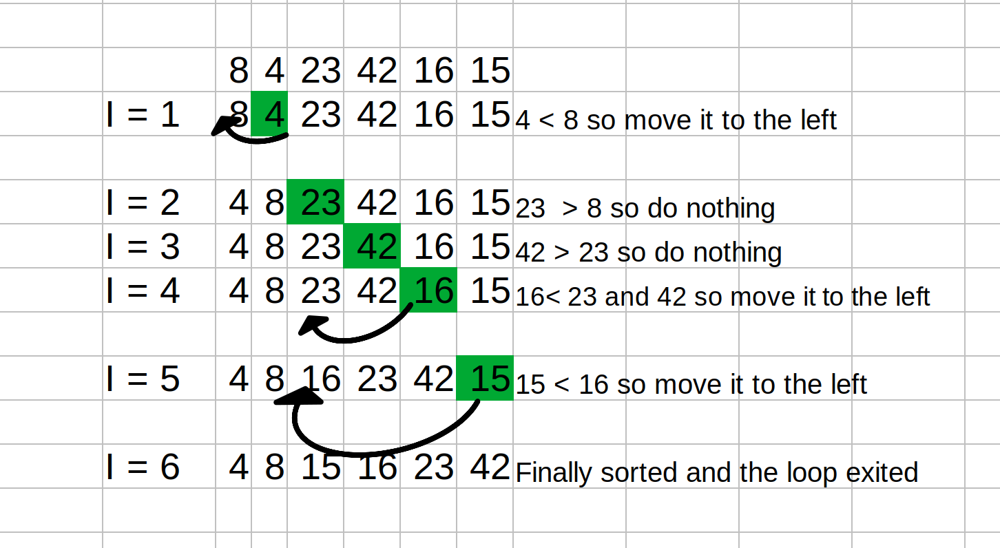

# Insertion Sort
In this article I will show how the Insertion Sort algorithm works. I will pass the algorithm the list of unsorted list [8,4,23,42,16,15] and show visually how the algorithms works with each iteration.

The Insertion Sort according to Wikipedia "Insertion sort is a simple sorting algorithm that builds the final sorted array one item at a time. It is much less efficient on large lists than more advanced algorithms such as quicksort, heapsort, or merge sort"

## Pseudocode
```
 InsertionSort(int[] arr)

    FOR i = 1 to arr.length

      int j <-- i - 1
      int temp <-- arr[i]

      WHILE j >= 0 AND temp < arr[j]
        arr[j + 1] <-- arr[j]
        j <-- j - 1

      arr[j + 1] <-- temp
```

## Tracing
Sample input: [8,4,23,42,16,15]
Using the pseudocode above let's step into our for loop:

* `FOR i = 1 to arr.length` i represents the index of our list and assigned to index 1 when we start and we loop until the end of our list in this case (length = 6)
* `int j <-- i - 1` j represents the i - 1 which enables us keep track of the previous item.
* `int temp <-- arr[i]` We store the value of index i in a temp variable.
* `WHILE j >= 0 AND temp < arr[j]` we declare a while loop inside our for loop (nested loop) and our while loop iterates as long as j is greater than or equal zero and our sorted list is less than the value of index j value.
* `arr[j + 1] <-- arr[j]` we move right until we find the position to store in temp value
* `j <-- j - 1` decrement j one position to the left
* `arr[j + 1] <-- temp` outside the while loop we assign the value to  `arr[j + 1]`. Loop repeats until all items are sorted.
# Visual


# Big O
* Time: O(n^2) as we have a nested loop
* Space: O(n) as we are not using addition spaces.