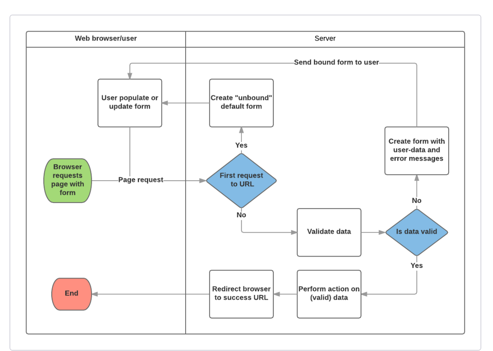

# Django Forms
* Forms are used to collect information from users.
* Forms allow different types of data, including text boxes, checkboxes, radio buttons, date pickers etc.
* Forms are somewhat secure as they use POST requests which comes with protection against forgery.
* Django Forms handle of the traditional form steps by providing a framework that lets us define our form requirements and fields easily compared to an HTML Form.
HTML Form:
```
<form action="/team_name_url/" method="post">
    <label for="team_name">Enter name: </label>
    <input id="team_name" type="text" name="name_field" value="Default name for team.">
    <input type="submit" value="OK">
</form>
```

### Django form handling process

The Django/Django Form class helps with the following process and tasks:
1. Display the default form the first time it is requested by the user
2. Receive data from a submit request and bind it to the form
3. Clean and validate the data.
4. If any data is invalid, re-display the form, this time with any user populated values and error messages for the problem fields.
5. If all data is valid, perform required actions (e.g. save the data, send an email, return the result of a search, upload a file, etc.)
6. Once all actions are complete, redirect the user to another page.

The Form class handles:
* Fields specification
* Layout
* Display widgets
* Labels
* Initial values
* Valid values
* Error messages
* Methods for rendering itself in teplates

### Declaring a Form is as below:
```
import datetime

from django import forms

from django.core.exceptions import ValidationError
from django.utils.translation import gettext_lazy as _

class RenewBookForm(forms.Form):
    renewal_date = forms.DateField(help_text="Enter a date between now and 4 weeks (default 3).")

    def clean_renewal_date(self):
        data = self.cleaned_data['renewal_date']

        # Check if a date is not in the past.
        if data < datetime.date.today():
            raise ValidationError(_('Invalid date - renewal in past'))

        # Check if a date is in the allowed range (+4 weeks from today).
        if data > datetime.date.today() + datetime.timedelta(weeks=4):
            raise ValidationError(_('Invalid date - renewal more than 4 weeks ahead'))

        # Remember to always return the cleaned data.
        return data
```

<br />

## References

[Working with forms](https://developer.mozilla.org/en-US/docs/Learn/Server-side/Django/Forms)

<br />

## [<-- Back](README.md)
